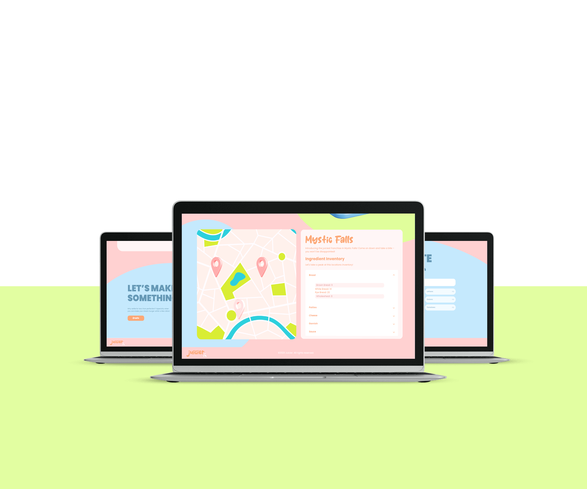
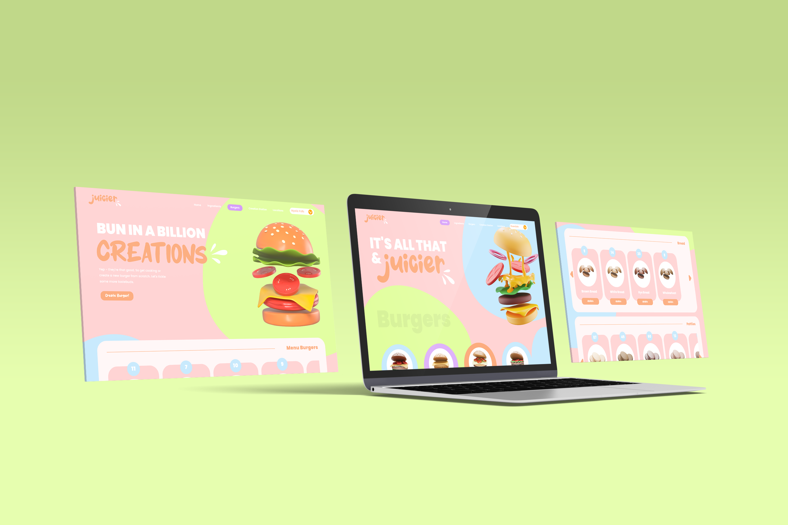

# Juicier
 Juicier - Team 1 Inventory Management application for DV300

 

 

<!-- HEADER SECTION -->
<h3 align="center" style="padding:1;margin:0;"> Designed & Developed by:</3>
<h5 align="center" style="padding:1;margin:0;">Alexa Pettitt</5>

<h6 align="center">DV 300 | Term 1 | 2023 </5>
 

## Table of Contents

* [About The Project](#about-the-project)
    * [Project Description](#project-description)
    * [Built With](#built-with)
 * [Getting Started](#getting-started)  
    * [Prerequisites](#prerequisites)
    * [How To Install](#how-to-install)
* [Development Process](#developmentProcess)
* [Final Outcomes](#developmentProcess)
* [License](#license)
* [Contact](#contact)
* [Acknowledgements](#acknowledgements)

 
<!-- PROJECT DESCRIPTION -->
## About the Project
We were tasked with creating a complete MEAN Stack application, through the use of typescript and Angular, that would allow for inventory management - following a concept of our choosing. 

I chose to create a build-a-burger website, and thus, came up with the concept of Juicier! A fun and playful website that encourages an exciting user experience!

### Project Description
Juicier is a full MERN stack application that allows users to keep track of their ingredient and burger inventory across the franchises different locations! It allows for easy inventory management, ensuring users a quick and easy solution to their management needs!

### Built With
* [Angular]
* [Typescript]
* [MONGODB]
* [Javascript]

<!-- GETTING STARTED -->
## Getting Started
The following steps and isntructions will allow you to copy the project on your local machine for development, practising and testing purposes.

### How to Install
List 
### Installationile | Open...` from the menu.
In the project directory, you can run:

### `npm start`

Runs the app in the development mode.\
Open [http://localhost:3000](http://localhost:3000) to view it in your browser.

The page will reload when you make changes.\
You may also see any lint errors in the console.

### `npm run start` 
alternatively
### `nodemon server.js`

## Concept Process
`Conceptual Process`
#### Brainstorm
In order to ensure that Code Quest exudes a distinct brand identity, We initially brainstormed ideas of how we could create a user friendly website, that would appeal to the developers of Open Window.

#### Mood boards
Once we had a general idea of the identity of our website - we created mood boards and discussed the stylistic approach we would take. We ultimately decided on a clean, minimalistic style with quirky illustrations. Balancing professional and fun.

#### Wireframes
Lastly, we began wireframing  -this allowed for smoother front-end development,

<!-- DEVELOPMENT PROCESS -->
## Development Process

The `Development Process` is the technical implementations and functionality done in the frontend and backend of the application.

Once I had finalized the designs, the real fun began.

I created the database structure for my burgers, ingrediants and users, and once this was complete - I had a greater understanding of how I would implement the required functionality. 

### Implementation Process
<!-- stipulate all of the functionality you included in the project -->
<!-- This is your time to shine, explain the technical nuances of your project, how did you achieve the final outcome!-->
Angular,  free and open-source web application framework built on Typescript, was utilized to create this project. Allowing the establishment of our website through object-orientated programming.

Node. js is a platform for building i/o applications which are server-side event-driven and made using JavaScript. Express. js is a framework based on Node. js, which is used for building web-application using approaches and principles of Node. These were utilized to create the server-side functionality and allowed me to use Mongo DB Atlas to store our persistent data and create a usable collaborative website.

* Utilized and implemented `Angular` for the frontend.
* Using MONGO DB ATLASS as our backend server
* Utilized JWT for password hashing 

### The Functionality

#### Ingredient Inventory Management
Juicier is a user-first website, meaning creating a user-friendly website is a top priority. 

I have established this through creating an inventory management Ingredient page which provides the user the opportunity to view their ingrediants in categories and provides the amount of each! Moreover, the user is provided the power to update these amounts!

#### Burger Inventory Management
Burgers, burgers, burgers! A website dedicated to burgers needs to make them easy to manage!

Similary to the Ingredient Inventory, an overview of the burgers and their amounts are provided. They are devided into 2 categories - the menu burger and the special creations. This ensures a pleasent user experience by making use of the principles of design!

But that's not all! You can also build more burgers, granted you have enough ingredients, and watch your inventory update accordingly!

#### Alternative Fun Login 
We keep it fun - and that's why we created an alternative to the regular old password.

Users can now login using their username and by naming their favourite burger! But do not worry! We still make sure your favourite burger is kept a secret through password hashing!

#### Manage each location
Swopping and switching locations at a click of a button!

You are now able to view all the ingredients and burgers dependent on their location in order to ensure users are easily kept up to date and can quickly update each location inventory accordingly!

#### Location Breakdown
Summaries - we all love them! A nice breakdown of everything you need to know.

And that is precisely why we created the location page. A page that gives our users a breakdown of the ingrediants available in each location! Making it short, sweet, easy to understanding and bring your attention to the ingredients that are running low.

#### 404 Error Page
We want you to enjoy every moment of our website. 

Therefore,  we implemented a 404 page. To ensure that the user can always find their way back to the magic.

### Above & Beyond
<!-- stipulate all of the functionality you included in the project -->
<!-- This is your time to shine, explain the technical nuances of your project, how did you achieve the final outcome!-->

* Creation Station - create your own personalized burger recipes! Click through the ingredients and invent your own masterpiece.
* BehaviorSubject - allows the changes made in the select to reflect immidiatly on the page.

### Challenges, Highlights & learnings

#### Challenges
<!-- stipulated the challenges you experienced with the project -->
Hurdles will always pop up along the way, and this project was no different. My biggest challenge was ensuring that my components rerender to show updates, without having to refresh the page. This was a struggle that came with the learning curve of Angular and required a lot of additional research. However, after scourering the internet and asking Angular coders for their opinions, I was introduced to BehaviourSubject and was able to overcome this issue.

#### Highlights
<!-- stipulated the highlights you faced with the project and why you think you faced it or how you think you'll solve it (if not solved) -->
I think this was surprisingly a very enjoyable project. Watching my functionality come together and create a fully functioning website was definitely a highlight. I felt that this project showed me how I have been able to grow as a developer through the years.

### Learnings
<!-- stipulate functionality and improvements that can be implemented in the future. -->
This project gave me greater insight into creating a full-stack application. I learnt the importance of being able to problem solve and consider all possible solutions.

I now believe I am better equipt to handle all future projects.

### Future Implementation
In future, I would like to explore more above and beyond features. In addition to this, I would like to implement loaders to further enhance the user experience.

 

See the [open issues](https://github.com/AlexaPea/DV300_Term1_Juicier) for a list of proposed features (and known issues).

<!-- AUTHORS -->
## Authors

* **Alexa Pettitt** - [AlexaPea](https://github.com/AlexaPea/DV300_Term1_Juicier)

<!-- LICENSE -->
## License

Distributed under the MIT License. See `LICENSE` for more information.\

<!-- LICENSE -->
## Contact

<!-- * **Shanre Scheepers** - [email@address](mailto:shanrescheepers@gmail.com) - [@instagram_handle](https://www.instagram.com/shanre_scheepers/)  -->
* **Project Link** - https://github.com/AlexaPea/DV300_Term1_Juicier

<!-- ACKNOWLEDGEMENTS -->
## Acknowledgements
<!-- all resources that you used and Acknowledgements here -->
* https://stackoverflow.com/
* https://angular.io/
* https://material.angular.io/

<!-- * [StackOverflow ](https://stackoverflow.com/questions/37966288/could-i-download-the-event-log-from-the-firebase-console)
* [Headers Error](https://developer.mozilla.org/en-US/docs/Web/HTTP/Headers/Access-Control-Allow-Headers) -->